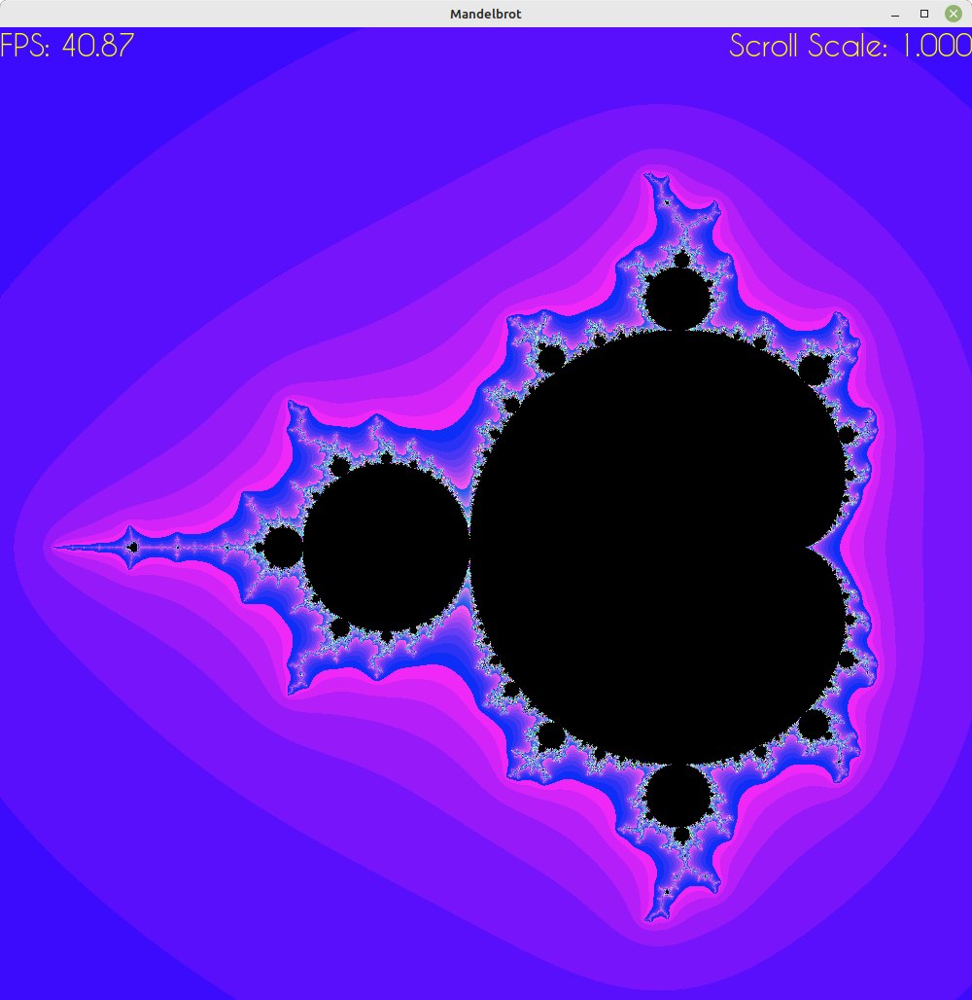
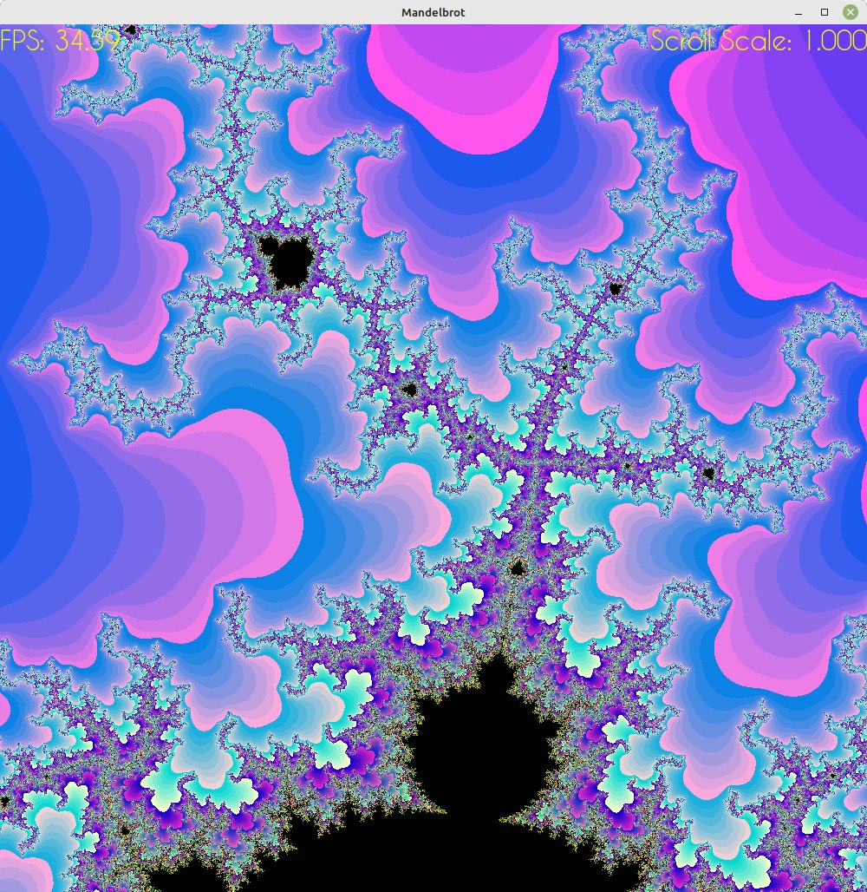
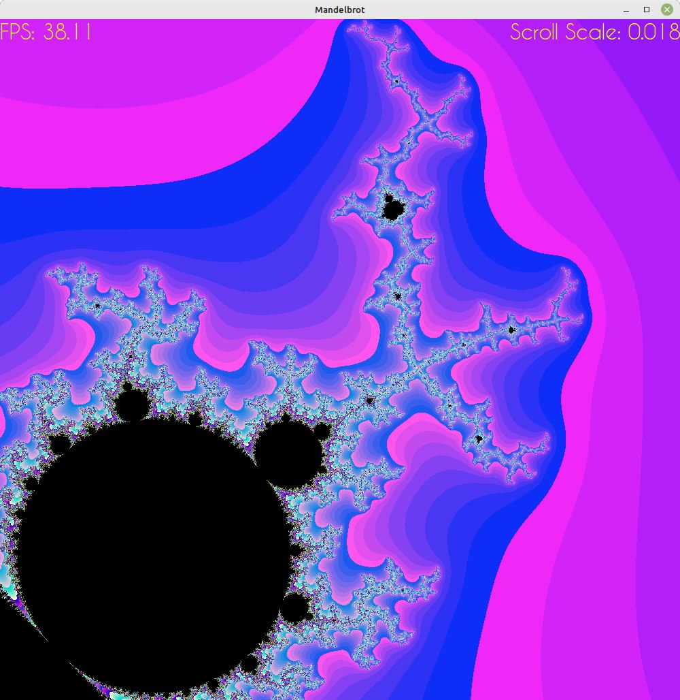

# Mandelbrot set

## Introduction

This projects is part of I.R. Dedinskiy programming course (1st year MIPT DREC). \
The goal is to draw a mandelbrot set and optimize it using SIMD instructions.

For visualization we will use SFML library.

## About Mandelbrot set
The Mandelbrot set is the set of complex numbers ${\displaystyle c}$ for which the function ${\displaystyle f_{c}(z)=z^{2}+c}$ does not diverge to infinity when iterated from ${\displaystyle z=0}$, i.e., for which the sequence ${\displaystyle f_{c}(0)}$, ${\displaystyle f_{c}(f_{c}(0))}$ etc., remains bounded in absolute value.

For more detailed information please visit the link below: \
https://en.wikipedia.org/wiki/Mandelbrot_set

## Math behind it
We have a plane with x and y coordinats. For each dot (pixel) with coordinates ($x_0, y_0$) on the plane we calculate a sequence according to the following algorithm:
- $x_{n+1} = x_n^2 - y_n^2 + x_0$
- $y_{n+1} = 2 \cdot x_n \cdot y_n + y_0$

We stop calculating as soon as we reach 50 iterations or $x_{n}^2 + y_{n}^2 > MaxDistance^2$

In our case $MaxDistance = 10$

Color of each pixel depends on how much iterations were made before stopping.
I decided to stick with following formula:

$(R, G, B) = (n \cdot 30, \text{ } n \cdot 5, \text{ } 255 - n)$

where n is amount of iterations for current pixel. 

## Basic implementation
Let's just code given algorithm for each pixel individually.
~~~C++
int cur_iter = 0;
float x = x0, y = y0;
for ( ; cur_iter < MAX_ITER; cur_iter++) {

    float x2 = x * x, y2 = y * y, xy = x * y;
    float distance = x2 + y2;
    if (distance > MAX_DISTANCE)
        break;

    x = x2 - y2 + x0;
    y = xy + xy + y0;
}
~~~

## Optimisation ideas

Our calculations for each pixel are absolutely the same and completely independent. So why don't we calculate the resulting colors for several pixels simultaneously?
Here the SIMD instructions come to the rescue. If you are not familiar with SIMD, check the following link: \
https://en.wikipedia.org/wiki/Single_instruction,_multiple_data \
For complete list of SIMD instructions check \
https://www.laruence.com/sse/# 

Let's put 8 pixels in a 256-bit vector and calculate all 8 resulting colors in 1 iteration.
~~~C++
__m256i cur_iters =  _mm256_set1_epi32(0);
__m256 x = x0_arr;
__m256 y = y0_arr;

 for (int iterator = 0; iterator < MAX_ITER; iterator++) {

    __m256 x2 = _mm256_mul_ps(x, x);
    __m256 y2 = _mm256_mul_ps(y, y);
    __m256 xy = _mm256_mul_ps(x, y);

    __m256 dist = _mm256_add_ps(x2, y2);

    __m256 mask = _mm256_cmp_ps(dist, max_dist, _CMP_LT_OQ);      // FFFFFFFF (= -1) if true, 0 if false

    int res = _mm256_movemask_ps(mask);
    if (!res)  break;                                             // all distances are out of range

    cur_iters = _mm256_sub_epi32 (cur_iters, _mm256_castps_si256 (mask));   //cur_iter + 1 or cur_iter + 0

    x = _mm256_add_ps(_mm256_sub_ps(x2, y2), x0_arr);
    y = _mm256_add_ps(_mm256_add_ps(xy, xy), y0_arr);

 }
~~~

Color calculations are the same for AVX & NO-AVX versions:
~~~C++
 color = sf::Color((BYTE)cur_iter * 30, (BYTE) cur_iter * 5, (BYTE) 255 - cur_iter);
~~~

## Results

FPS (frames per second) for each tested configuration. 

| flags    | NO AVX, FPS | AVX, FPS |
|----------|-------------|----------|
| no flags | 5.2         | 14.6     |
| -O1      | 13.2        | 54.1     |
| -O2      | 12.6        | 54.1     |
| -O3      | 12.6        | 54.2     |
| -Ofast   | 14.1        | 56.1     |

Speed growth factor $k_1$ = $\frac{FPS_{AVX}}{FPS_{NO-AVX}}$

| AVX\NOAVX | no flags  | -O1  | -O2  | -O3  | -Ofast |
|-----------|-----------|------|------|------|--------|
| no flags  | 2.80      | 1.11 | 1.16 | 1.16 | 1.04   |
| -O1       | 10.40     | 4.10 | 4.30 | 4.30 | 3.84   |
| -O2       | 10.40     | 4.10 | 4.30 | 4.30 | 3.84   |
| -O3       | 10.42     | 4.11 | 4.30 | 4.30 | 3.84   |
| -Ofast    | 10.79     | 4.25 | 4.45 | 4.45 | 3.98   |

As we can see, the best speed growth factor $k_1$ with the same flags was achieved with "-O3" flag (4.302).

The best FPS was achieved with AVX and "-Ofast" flag. Speed growth factor here is 3.98.

Speed growth factor $k_2$ = $\frac{FPS_{flag}}{FPS_{no-flag}}$

| flags    | NO AVX, $k_2$ | AVX, $k_2$ |
|----------|---------------|------------|
| no flags | 1             | 1          |
| -O1      | 2.54          | 3.71       |
| -O2      | 2.42          | 3.71       |
| -O3      | 2.42          | 3.71       |
| -Ofast   | 2.71          | 3.84       |

As we can see, the best speed growth factor $k_2$ for NO_AVX is 2.71 (with "-Ofast"). In the same time $k_1$ for "-Ofast" is 3.98.

## Conclusion

We have reached the highest performance combining SIMD instructions and compiler optimization.
Now take a look at some beautiful shots :)  

